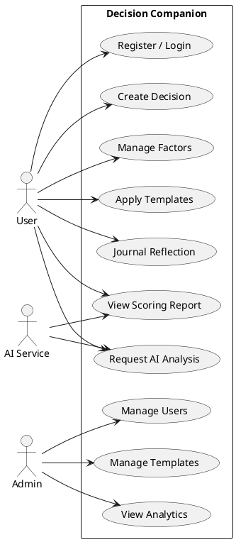
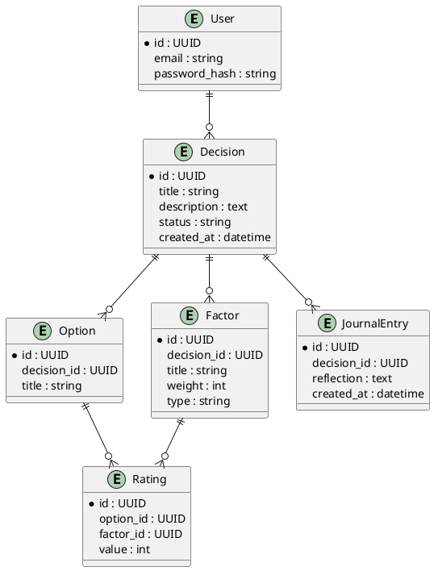
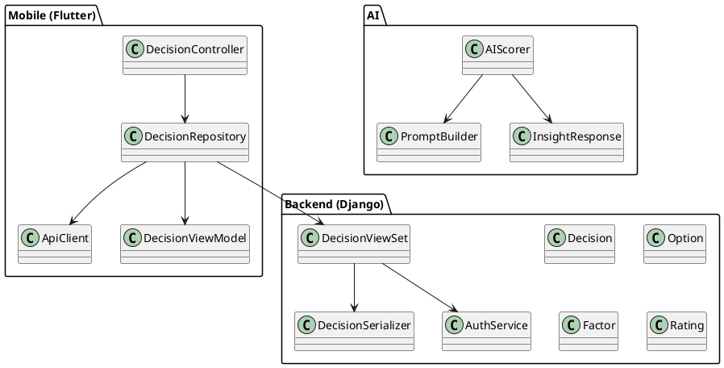

# Title Page

**Project Name:** Decision Companion - AI Decision Making System  
**Prepared by:** Decision Helper  
**Abstract:** Decision Companion is a mobile decision-support application that helps users make complex choices by combining a weighted scoring model with AI-generated insights. Users create decisions, define alternatives, and attach factors that represent pros, cons, priorities, and confidence ratings. The application calculates transparent option scores and visualizes factor influence so that trade-offs are explicit. A built-in AI assistant powered by the OpenAI GPT-4 API interprets the structured data, summarizes key risks, highlights missing information, and suggests clarifying questions before a decision is finalized. The backend is implemented with Django 5+ and Django REST Framework, using JWT-based authentication, normalized relational models, and RESTful endpoints for decisions, factors, templates, and journaling reflections. The architecture separates the Flutter mobile client from service logic to improve maintainability and scalability, while supporting SQLite for development and PostgreSQL for production. This documentation details the research background, requirements, UML models, design, and implementation of the system, and evaluates how it supports transparent, repeatable decision-making. Decision Companion targets personal, academic, and professional contexts where cognitive bias and information overload can degrade judgment, offering a blend of quantitative analysis and narrative explanation. It emphasizes accountability, learning, and user control by preserving decision history and post-decision reflections for future improvement cycles.

# 1. Chapter One

## 1.1 Introduction
Decision-making is a core human activity that affects academic success, career direction, financial stability, and personal well-being. Many everyday choices are complex, multi-dimensional, and uncertain, requiring trade-offs between cost, benefit, risk, and long-term impact. In these circumstances, intuition alone is often insufficient because it is influenced by cognitive bias, emotional framing, and limited working memory. A decision-support system can externalize this reasoning, make hidden assumptions visible, and help users evaluate options with consistent criteria.

Digital transformation has changed how people access information, but it has not automatically improved decision quality. Mobile devices provide continuous access to data, yet the process of comparing options remains manual and fragmented. People typically rely on unstructured notes or informal advice, leading to choices that are difficult to justify or revisit later. A structured, mobile-first decision tool can bridge this gap by guiding users through a transparent workflow and presenting results in an understandable form.

Decision Companion is designed to provide this structure while maintaining flexibility. It combines a quantitative weighted scoring model with an AI-driven analysis layer that interprets trade-offs and highlights missing data. The result is a decision process that is repeatable, explainable, and accessible from a smartphone, supporting both rational evaluation and reflective reasoning.

## 1.2 Background
The study of decision-making spans psychology, economics, and information systems. Descriptive models demonstrate that human decisions often deviate from rational choice due to heuristics such as anchoring, availability bias, and loss aversion. Normative approaches, such as multi-criteria decision analysis, aim to optimize choices by scoring alternatives against explicit criteria. In practice, people rarely apply formal methods because they are time-consuming or overly technical.

Traditional techniques like pros and cons lists offer simplicity but lack a mechanism to represent relative importance. Two factors with vastly different consequences may be listed side by side without acknowledging their unequal weight. This creates a false sense of balance and can lead to decisions that prioritize convenience over long-term value. A weighted scoring model addresses this by assigning numeric importance to each factor and computing a transparent total score for each option.

Digital tools have attempted to support structured decision-making through spreadsheets or decision matrix templates, yet these tools remain cumbersome on mobile devices and often fail to integrate interpretive guidance. Users must still translate numbers into meaning and recognize missing information on their own. Decision Companion builds on these foundations with a mobile-first experience, a normalized data model, and an AI interpretation layer that turns scores into clear narratives.

## 1.3 Motivation
The motivation for Decision Companion is to make structured decision support practical for everyday use. Many individuals understand the value of analytical frameworks but lack tools that are intuitive, portable, and context-aware. A mobile application reduces friction by allowing decisions to be captured at the moment they arise, while AI assistance can provide guidance without requiring the user to study complex methodologies.

Another motivation is to preserve decision rationale for future learning. People often forget why a choice was made, which makes post-decision reflection difficult. By recording factors, weights, and AI insights, Decision Companion creates a traceable record that can be revisited and evaluated after outcomes are known. This not only improves accountability but also fosters gradual improvement in decision quality over time.

Finally, the project aims to demonstrate how modern AI services can complement rather than replace human judgment. The system is designed to support users by clarifying trade-offs and suggesting missing considerations, while preserving user control over the final decision.

## 1.4 Problem Definition
Complex decisions involve multiple options and multiple factors, each with varying importance and uncertainty. Users struggle to translate these factors into a coherent evaluation because human cognition is not optimized for multi-criteria aggregation. Informal approaches such as simple lists or conversational advice often overlook key constraints or exaggerate short-term benefits.

Formally, the problem can be described as follows: given a decision with options $O = \{o_1, o_2, \ldots, o_m\}$ and factors $F = \{f_1, f_2, \ldots, f_n\}$, users must assign weights $w_i$ and ratings $r_{ij}$ that reflect the importance of each factor and the performance of each option. Without support, users either avoid weighting entirely or apply inconsistent scales, resulting in scores that are not comparable or explainable. The absence of interpretive guidance further increases uncertainty, especially when data are incomplete or ambiguous.

Decision Companion addresses this problem by providing structured inputs for weights and ratings, automated scoring for each option, and AI-generated narratives that interpret the results. The system reduces cognitive load while maintaining transparency, enabling users to make informed choices even under uncertainty.

## 1.5 Why Decision Companion?
Decision Companion differentiates itself by integrating three complementary capabilities: formal factor weighting, AI-driven interpretation, and reflective journaling. Factor weighting provides mathematical transparency, ensuring that high-importance issues influence results proportionally. AI interpretation converts numerical output into narrative insights, identifying dominant drivers, potential risks, and missing information. Journaling captures user reflections after the decision, creating a feedback loop that can improve future decision quality.

The system is designed for accessibility and explainability rather than automation. Users remain in control of inputs, and the AI is constrained to analysis and suggestion rather than making a final recommendation. This design supports responsible use in personal and professional contexts where accountability is important. Decision Companion also supports reusable templates, which reduce friction for recurring decisions without sacrificing customization.

## 1.6 Objectives
- Deliver a guided workflow for defining decisions, options, and weighted factors.
- Provide transparent scoring that explains how each factor contributes to the final ranking.
- Generate AI insights that summarize trade-offs, uncertainties, and missing data.
- Offer reusable templates that standardize common decision structures.
- Preserve decision history, reflections, and outcomes for long-term learning.

## 1.7 Expected Outcome
The expected outcome is a fully functional mobile decision-support system that balances quantitative analysis with qualitative understanding. Users can structure complex choices, compare options through weighted scoring, and receive AI guidance that improves clarity without removing autonomy. The system also provides a persistent record of decision rationale and post-decision reflections, enabling users to revisit outcomes and learn from prior experiences.

At the technical level, the project delivers a scalable architecture with a Flutter mobile client and a Django REST backend. The architecture supports secure authentication, modular app domains, and integration with external AI services. Together, these outcomes demonstrate the feasibility of using AI-augmented decision tools to improve everyday judgment.

# 2. Chapter Two

## 2.1 Related Works
Decision-support tools in consumer software are typically simplified to checklists, ranking apps, or general note-taking platforms. Pros and cons lists are widely used because they are easy to create, but they rarely capture the relative importance of factors or the uncertainty associated with them. Polling and ranking apps can gather opinions but focus on group preference rather than structured reasoning. General note apps provide flexibility but do not enforce decision-specific logic, leading to unstructured records that are difficult to analyze later.

In academic and business contexts, decision matrices and multi-criteria decision analysis frameworks are commonly used. These methods are rigorous, but they often require spreadsheets and expertise that are not suited to casual or mobile usage. Furthermore, they provide limited interpretive guidance; users must still convert numeric scores into actionable reasoning. Decision Companion builds on the strengths of these frameworks while addressing their limitations with a guided mobile workflow and AI interpretation.

Reflective journaling platforms also inform this work. They emphasize learning from outcomes, yet they rarely connect reflections to structured decision data. By combining decision matrices with journaling, Decision Companion supports both pre-decision analysis and post-decision learning in a single experience.

## 2.2 Comparative Studies
Manual lists rely on the user to mentally balance factor importance, which introduces inconsistency and bias. Weighted scoring models formalize this process by assigning numeric values to both factor importance and option ratings. Decision Companion implements a weighted sum model in which each option score is computed as:

$$
Score_j = \sum_{i=1}^{n} w_i \times r_{ij}
$$

When weights are normalized to sum to one, the score remains comparable across decisions and options. This method makes trade-offs visible and reduces the likelihood that minor factors dominate the decision simply because they are more salient. The model also allows sensitivity analysis, where small changes in weights can be tested to evaluate stability of the outcome.

AI interpretation further distinguishes Decision Companion from traditional approaches. While a manual decision matrix yields a numeric ranking, the AI layer generates narrative explanations that contextualize the results. It highlights which factors contributed most to the top-ranked option, identifies missing or low-confidence data, and suggests additional questions to refine the analysis. This combination of quantitative scoring and qualitative interpretation produces a richer decision experience than either component alone.

## 2.3 Scope of the Problem
The system targets complex but everyday decisions in personal, academic, and professional settings. Examples include choosing a university program, selecting between job offers, deciding on a major purchase, or evaluating business alternatives. These decisions share characteristics of multiple criteria, incomplete information, and trade-offs that must be weighed explicitly.

The scope intentionally excludes domains that require certified professional advice, such as medical diagnosis, legal judgments, or high-stakes safety-critical engineering. In these areas, an AI-supported decision tool could be misinterpreted as authoritative guidance. Decision Companion is positioned as a support system rather than a replacement for professional expertise.

The project is also constrained by mobile usability and data availability. Users may not have complete information for all factors, so the system must tolerate partial data while still providing useful guidance. This constraint informs both the scoring model and the AI interpretation strategy.

## 2.4 Challenges
Three technical challenges shaped the system design. The first challenge was creating an interface that handles complex data without overwhelming users. Decision factors, weights, and ratings must be entered efficiently on a small screen, and the workflow must remain understandable for non-technical users. This required careful UI structuring and progressive disclosure of complexity.

The second challenge was integrating real-time AI analysis with acceptable latency and cost. External AI APIs introduce network delays and usage fees, so the system must minimize prompt size, cache results when possible, and provide fallbacks when connectivity is limited. The AI response also had to be constrained to avoid overconfidence or prescriptive language.

The third challenge was designing a relational database schema that supports variable decision structures. Each decision may have a different number of options and factors, creating many-to-many relationships between options and factors via ratings. The backend must support efficient queries and maintain data integrity while allowing the flexibility required for diverse decision contexts.

# 3. Chapter Three

## 3.1 Requirements & Analysis

This chapter defines the system requirements and provides a formal analysis of the functional behavior, quality attributes, and modeling artifacts used to guide implementation. Requirements were derived from stakeholder interviews, decision-support literature, and early prototyping sessions. The analysis balances usability needs with technical feasibility and establishes clear boundaries for the system.

Stakeholders included students, early-career professionals, and small business users who frequently make multi-criteria decisions but lack formal decision-support tools. Requirements were validated through scenario walkthroughs and paper prototypes to ensure that the workflow was understandable without training. The resulting scope prioritizes clarity, transparency, and a minimal number of steps while preserving flexibility for different decision contexts.

Requirements were categorized as essential or supportive. Essential features are required for the decision lifecycle (create, evaluate, analyze, reflect), while supportive features improve usability and retention (templates, search, history). This distinction helps manage project scope and provides a roadmap for incremental enhancement.

### 3.1.1 Functional Requirements
Functional requirements describe what Decision Companion must do for end users and administrators. Each requirement is tied to a specific workflow in the mobile client or the backend service layer.

The core user workflow includes five stages: capture the decision, define options, define and weight factors, rate options, and review results. The system must also support a reflection stage that preserves learning after the decision is made. The application deliberately does not automate or execute decisions; it provides structured evaluation and interpretive guidance while leaving final judgment to the user.

- Authentication and profile management: Users can register, log in, refresh tokens, log out, and update profile data. The system must support password change and token revocation on logout or device reset.
- Decision lifecycle management: Users can create a decision with title, description, tags, and status; edit or archive a decision; and duplicate a decision to reuse factors and options.
- Option management: Each decision supports multiple options with ordered display, short descriptions, and optional notes.
- Factor management and weighting: Users can add factors, classify them as pro or con, assign numeric weights within a defined range, and optionally import factors from templates.
- Rating capture: Users rate each option against each factor using a consistent scale. The system validates missing ratings and highlights incomplete matrices.
- Scoring and reporting: The system computes weighted scores for each option, displays factor contributions, and provides summary ranking and comparison views.
- AI analysis workflow: Users can request AI analysis, view generated insights and clarifying questions, and store the analysis as part of the decision record.
- Template library: Users can save, edit, and reuse factor templates. Administrators can curate global templates for common decision categories.
- Journaling and reflection: After a decision is finalized, users can record reflections, outcomes, and satisfaction levels that remain attached to the original decision.
- History and filtering: Users can search, filter, and sort past decisions by status, date, or category, and review stored analyses and reflections.
- Administrative management: Admins can manage users, templates, and content, monitor AI usage, and review feedback reports.

In addition to these capabilities, the system enforces business rules for scoring. Weights are normalized to reduce bias introduced by large numeric ranges. Ratings must adhere to a consistent scale so that comparisons are meaningful. The scoring model distinguishes between positive and negative factors by applying sign or transformation rules. AI analysis is only allowed when sufficient data are present, and the system warns users when missing ratings could compromise confidence.

The rating scale is designed to be simple yet expressive, using a small integer range (for example, 1 to 5 or -3 to 3) that is consistent across factors and options. The system recalculates scores in real time as ratings are entered so users can observe how individual factors influence outcomes. Templates are treated as reusable factor sets that can be customized per decision without affecting the original template definition.

The system also supports data integrity rules that reduce user error. For example, factors cannot be assigned zero weight if they are included in the scoring model, and option titles must be unique within a single decision to prevent confusion in the rating matrix. These constraints improve the reliability of stored decision records.

### 3.1.2 Non-Functional Requirements
Non-functional requirements specify the quality attributes that make the system reliable, secure, and usable at scale.

- Security: JWT-based authentication with short-lived access tokens and refresh tokens, secure password hashing, and role-based access control for admin features.
- Privacy: User data ownership, export and deletion capabilities, and clear segregation of user-specific data at the database level.
- Performance: Responsive mobile UI, API responses for CRUD operations under 300 ms on average, and AI analysis responses within a practical target window (typically under 10 seconds).
- Scalability: Stateless API design so services can scale horizontally, with database indexes supporting large numbers of decisions per user.
- Reliability: Graceful handling of network failure, retries for transient errors, and idempotent operations for critical endpoints.
- Maintainability: Modular code structure, consistent naming conventions, and automated tests for core models and endpoints.
- Usability: Clear input validation, guided workflows, and minimal required steps for decision creation.
- Portability: Full support for Android and iOS, with consistent behavior across devices and screen sizes.
- Observability: Structured logging, basic metrics for AI usage, and error reporting for production troubleshooting.

Security requirements include TLS for data in transit and secure storage of tokens on the client. Passwords are stored using a modern hashing algorithm, and administrative actions require higher privilege levels. Rate limiting and input validation are used to mitigate abuse of authentication endpoints and AI analysis requests.

Performance targets are defined to preserve a smooth user experience. The mobile UI should respond within 100 ms to local interactions, and backend CRUD operations should complete quickly under normal load. AI analysis is allowed a longer response window, but users should receive clear progress indicators and the ability to cancel or retry. These targets align with expectations for mobile-first applications.

Reliability and maintainability are supported through automated tests, code reviews, and structured logging. The system should degrade gracefully under poor connectivity by allowing local entry and deferring AI analysis. Backup and data retention policies ensure that user decision history remains available even in the event of hardware failures.

### 3.1.3 Hardware Requirements
Decision Companion must operate efficiently on consumer-grade smartphones and scale on modest server infrastructure.

- Mobile device: At least 4 GB RAM, a modern ARM CPU, 500 MB free storage, and Android 8+ or iOS 13+.
- Server hosting: 2 vCPUs, 4 GB RAM, and SSD storage for production. A minimal environment can serve early adopters, while the architecture supports upgrades.
- Network: Stable internet access for authentication, data sync, and AI analysis. The client should remain usable for local data entry during temporary outages.

Development and testing can be performed on mid-range laptops with 8 GB RAM or more. Android emulators and iOS simulators are supported for UI validation, while real-device testing is recommended for performance profiling and touch interaction assessment.

### 3.1.4 Software Requirements
The system is built with well-supported, modern frameworks to ensure long-term stability.

- Flutter SDK (stable) and Dart 3.x for mobile development.
- Python 3.10+ with Django 5+ and Django REST Framework.
- SimpleJWT for authentication, and an OpenAI API client for AI integration.
- PostgreSQL for production and SQLite for local development.
- Android Studio or Xcode for platform tooling, and Git for version control.
- Optional deployment tooling such as Docker and Nginx for server hosting.

Environment configuration includes API keys for the AI service, database connection strings, and secure secret management for JWT signing. The backend is designed to run under a standard WSGI or ASGI server, and the mobile client can be distributed through standard app store pipelines. Continuous integration is recommended to automate tests and linting on each code change.

## 3.2 UML Diagrams
UML diagrams provide a shared, language-agnostic description of system behavior and structure. These artifacts communicate how users interact with the system, how data are organized, and how software components are connected.

The diagrams in this section were used during design to align the frontend and backend teams on shared concepts. They also serve as documentation for future contributors who need to understand how decision data flows through the system. While the diagrams are high-level, they map directly to implemented models and API endpoints.

### 3.2.1 Use Case Diagram
The system includes three primary actors: User, Admin, and AI Service. Users perform decision creation, factor management, rating, and AI analysis requests. Admins curate templates, manage users, and monitor usage. The AI Service receives structured decision data and returns insights that are stored for later review. The use cases show the boundaries of the system and clarify which actions are available to each actor.

A typical flow begins with a user registering and creating a decision. The user adds options and factors, assigns weights, and completes ratings. The scoring report is generated locally and can be enhanced with AI analysis. After a decision is finalized, the user adds a journal entry. Admin tasks are separate and focus on system governance rather than core decision workflows.

Alternative flows include partial completion and deferred analysis. Users may save a decision with incomplete ratings and return later; in this case, the system preserves draft state without generating AI analysis. If an AI request fails due to connectivity or quota limits, the user receives a fallback explanation and can retry when the network is available. These paths are critical for a mobile-first environment where connectivity can be inconsistent.

### 3.2.2 ERD
The core entities are User, Decision, Option, Factor, and Rating. A User owns many Decisions. Each Decision includes multiple Options and Factors. The Rating entity links an Option to a Factor and stores the numeric evaluation. JournalEntry stores post-decision reflections. This structure supports a flexible number of options and factors per decision without duplicating data.

Key integrity constraints include unique identifiers per entity, foreign keys for ownership, and composite uniqueness for ratings to avoid duplicate entries for the same option-factor pair. Additional entities such as Template or AIAnalysis can be added without altering the core relationships, which allows the system to evolve while preserving existing data.

The ERD is normalized to reduce redundancy. Options and factors are stored separately from ratings so that the rating matrix can scale without duplicating descriptive metadata. This design improves query performance and simplifies updates. For example, renaming an option does not require updates to every rating row, and adding a new factor does not require changes to existing ratings.

If templates are included, a Template entity can be linked to TemplateFactor entries to represent reusable factor sets. AI analysis outputs can be stored in an AIAnalysis table keyed by decision, preserving the original input snapshot for auditability. These extensions can be added without disrupting the core data model.

### 3.2.3 Class Diagram
The class diagram presents a high-level view of the software architecture. The mobile layer contains controllers or view models that manage UI state and invoke a repository. The repository abstracts API communication via an ApiClient. The backend layer provides model classes for core entities, serializers for validation and representation, and viewsets that expose REST endpoints. The AI layer includes a prompt builder and scorer that translate decision data into AI requests and parse responses into structured insights.

This separation of concerns supports testability and maintainability. The mobile client can be tested with mock repositories, the backend can validate data independently, and the AI service can be isolated for integration testing.

Data flows from the UI into view models, then into repositories that manage local caching and API calls. Responses are mapped into domain models and propagated back to the UI. On the backend, viewsets validate incoming requests, invoke domain services such as the scoring engine, and return serialized responses. The AI service is invoked only when the decision has sufficient data, and its results are stored in a dedicated model so they can be retrieved without recomputation.

# 4. Chapter Four

## 4.1 Design
The design phase translated requirements into concrete user experiences and technical structures. The guiding principles were clarity, transparency, and low cognitive load. Each screen and API endpoint was designed to reduce ambiguity while preserving the flexibility required for diverse decision contexts.

Design decisions prioritized explainability. Scores are presented alongside the factors that drive them, and AI insights are framed as suggestions rather than instructions. The system uses progressive disclosure to avoid overwhelming users: only the next required step is emphasized, while advanced controls are accessible without cluttering the main flow.

The design also balances consistency with personalization. Standard templates provide a consistent starting point, while customization enables users to adapt factors to their unique context. This combination supports both novice and experienced users.

### 4.1.1 Admin Web Panel
The admin panel is implemented using Django Admin to provide centralized oversight with minimal custom development. It is organized by domain (accounts, decisions, factors, feedback, ai_service) so that administrators can locate data quickly. Admins can manage users, review activity, and enforce content standards for templates.

Key admin features include template curation, user moderation, and system monitoring. Templates are reviewed for clarity, duplicated content is consolidated, and deprecated templates can be archived without deleting historical decisions that reference them. User management includes account deactivation, password reset support, and basic role control. The admin panel also enables review of AI usage logs and feedback reports to identify issues with prompt quality or response relevance.

The design favors data integrity and auditability. Admin actions are logged, and sensitive fields are protected to avoid accidental disclosure. Filters and search tools make it easy to locate problem records, and the layout follows standard Django conventions to reduce training overhead.

Administrative dashboards provide basic analytics, such as total active users, average decisions per user, and AI analysis volume. These metrics help assess system health and inform capacity planning. Moderation features allow administrators to review reported content and investigate anomalies in AI responses. While the admin interface is not a user-facing product feature, it is essential for governance and quality control.

### 4.1.2 Flutter Mobile
The mobile client is designed around a progressive workflow that reduces cognitive load. The Home dashboard summarizes recent decisions and provides entry points to create a new decision, browse templates, or revisit historical outcomes. Navigation prioritizes a linear flow for first-time users while still allowing experts to jump between steps.

The Decision Creation Wizard is a core experience. It guides users through naming the decision, adding options, defining factors, and assigning weights. Factors can be toggled between pro and con categories, and weights are adjusted with sliders or numeric steppers. The rating matrix is presented in a compact grid with clear indicators for missing values. Users can preview the scoring summary at any time to validate the impact of their inputs.

The Analysis Report view combines numeric output with narrative explanation. It presents ranked options, factor contribution charts, and AI-generated insights. Visual cues highlight dominant factors and indicate confidence levels. The Journaling view appears after a decision is finalized, encouraging users to record their rationale and outcome. These reflections are integrated into the decision history to support future learning.

Accessibility considerations include readable typography, sufficient color contrast, large touch targets, and responsive layout for small screens. Error states use clear language and actionable suggestions rather than generic failure messages.

The UI uses a consistent design system with standardized spacing, typography, and component styles. Pros and cons are visually distinguished through color and iconography, while weights are represented with sliders and numeric labels for clarity. The rating matrix supports quick entry via tap or swipe, and missing values are highlighted to reduce oversight.

The AI analysis view includes a clear loading state, timestamped results, and indicators showing how confidence was computed. Users can re-run analysis after updating factors or ratings, and previous AI outputs remain accessible for comparison. These design decisions reinforce transparency and reduce the risk of over-reliance on a single AI response.

### 4.1.3 Back-End
The backend follows a modular architecture using Django REST Framework. Each app encapsulates a functional domain: accounts for authentication, decisions for core entities, factors for templates and weighting, feedback for user reports, and ai_service for AI integration. This separation enables independent evolution of each component while preserving a stable API.

Authentication is handled using SimpleJWT with refresh tokens, and permission classes ensure users can only access their own decisions. Core endpoints provide CRUD operations for decisions, options, factors, ratings, templates, and journals. Specialized endpoints trigger AI analysis and return stored insights. The service layer enforces business rules such as weight normalization, rating completeness checks, and duplicate prevention.

The API is designed to be predictable and RESTful. Example endpoint families include:

| Domain | Example Endpoints |
| --- | --- |
| Auth | /api/auth/register, /api/auth/token, /api/auth/refresh |
| Decisions | /api/decisions, /api/decisions/{id} |
| Options | /api/decisions/{id}/options |
| Factors | /api/decisions/{id}/factors, /api/templates |
| Ratings | /api/decisions/{id}/ratings |
| AI | /api/decisions/{id}/analysis |
| Journal | /api/decisions/{id}/journal |

The system relies on the Django ORM to abstract database differences between SQLite and PostgreSQL. Migrations manage schema changes, and indexes are added on foreign keys and date fields to optimize query performance.

API responses follow a consistent envelope that includes status codes, error messages, and validation details when applicable. Pagination is applied to decision history to maintain performance as data grows. For long-running AI requests, the backend supports timeouts and retries, returning a clear error message if the AI provider is unavailable.

Rate limiting protects sensitive endpoints and helps manage AI costs. Logging and monitoring are structured to support incident response, and configuration values are centralized to simplify environment management across development, staging, and production.

### 4.1.4 Artificial Intelligence (AI)
Decision Companion uses a two-layer intelligence strategy: deterministic scoring for transparency and AI narrative analysis for contextual understanding. The deterministic score uses weighted factors to ensure consistency across options. If $w_i$ represents the weight of factor $i$ and $r_{ij}$ represents the rating of option $j$ for that factor, the normalized score is computed as:

$$
w'_i = \frac{w_i}{\sum_{k=1}^{n} w_k}
$$

$$
Score_j = \sum_{i=1}^{n} w'_i \times r_{ij}
$$

Negative factors are represented by applying a sign or by using a rating scale that allows negative values. This ensures that high-risk or high-cost factors reduce the overall score proportionally to their weights. Missing ratings are flagged and excluded from scoring if the user chooses to proceed with incomplete data, with a warning that confidence is reduced.

The AI layer receives a structured prompt that includes decision context, options, factors, weights, ratings, and user notes. Prompt engineering prioritizes concise trade-off explanations, identification of missing information, and neutral phrasing to avoid prescriptive outcomes. The AI response includes a summary, key drivers, potential risks, and clarifying questions.

Confidence scoring is derived from data completeness, rating variance, and consistency across factors. A conceptual formulation can be expressed as:

$$
Confidence = \alpha C_{complete} + \beta C_{variance} + \gamma C_{consistency}
$$

where each component is normalized between 0 and 1 and weights $(\alpha, \beta, \gamma)$ reflect their relative importance. This confidence indicator helps users interpret the analysis responsibly and encourages additional data collection when confidence is low.

To manage cost and latency, the AI service caches recent analyses and limits prompt size. Requests are logged for troubleshooting and evaluation, and responses are stored alongside the decision so users can revisit the insights later.

Prompt construction is structured into sections that include decision context, options, factors with weights, rating summaries, and user notes. The system message defines the role of the AI as an analytical assistant and emphasizes neutrality. The user message provides the structured decision data and asks for a summary, dominant factors, and open questions. This structure minimizes hallucinations and keeps outputs consistent across different decisions.

The AI output is post-processed to extract key elements such as a short summary, risk flags, and suggested questions. These elements are displayed separately in the UI to improve readability. If the AI response contains prescriptive language, it is softened or annotated to preserve user autonomy. These safeguards reinforce responsible use of AI in decision-making contexts.

# 5. Chapter Five

## 5.1 Implementation
The project followed an iterative development process, beginning with requirements elicitation, low-fidelity prototypes, and schema design. Early iterations focused on the decision workflow and factor weighting to validate usability. The backend and mobile client were developed in parallel using an API-first approach, enabling the Flutter team to work with mock data before the full backend was complete.

Implementation progressed through cycles of integration and refinement. Each cycle delivered a functional slice of the system, such as authentication, decision creation, or AI analysis. Usability testing informed UI adjustments, while performance profiling guided optimization of API response times and AI prompt size. Code reviews and automated tests ensured that core workflows remained stable as features expanded.

The implementation timeline can be summarized as four phases: planning, core build, integration, and stabilization. Planning focused on data modeling and UX flows. Core build delivered authentication, decision CRUD, and scoring. Integration connected the AI service and refined templates. Stabilization focused on error handling, edge cases, and performance tuning. This phased approach reduced risk and ensured that foundational functionality was stable before advanced features were added.

Testing included unit tests for scoring logic, serializer validation, and authentication flows, as well as integration tests that simulate complete decision workflows. Manual exploratory testing was used to validate UI behavior on multiple device sizes and to verify the clarity of AI insights.

### 5.1.1 Mobile Application
The Flutter client is organized into presentation, state, and data layers. State management uses Provider or Bloc to coordinate screen updates and isolate business logic from UI widgets. Each feature module includes models, view models or blocs, and repository interfaces, which improves testability and clarity.

The decision creation flow is implemented as a multi-step wizard that validates inputs at each step. Local form validation checks for empty titles, missing weights, and invalid rating ranges. The rating matrix is built with efficient list rendering to handle variable numbers of options and factors.

API communication uses Dio or HTTP, with interceptors that attach JWT tokens and handle refresh flows transparently. When a token expires, the client requests a new access token using the refresh token and retries the original request. Error states provide actionable guidance, such as prompting the user to complete missing ratings or check connectivity.

Local caching improves perceived performance. Recent decisions and templates are stored in local storage, and a lightweight sync strategy reconciles changes when connectivity returns. The UI uses consistent spacing, typography, and color cues to differentiate pros and cons and to surface confidence indicators. Accessibility considerations include high-contrast elements and scalable text.

Score computation is performed locally so that users can see immediate feedback as they adjust weights and ratings. This local calculation mirrors the backend scoring logic to ensure consistency. When a user requests AI analysis, the client sends a structured payload that includes the current state of the decision, ensuring that the AI reflects the latest inputs.

To improve resilience, the client queues updates when the network is unavailable and syncs them when connectivity returns. Conflicts are resolved by preferring the most recent user edits. This strategy ensures that a decision can be drafted offline and finalized later without losing data.

### 5.1.2 Backend Implementation
The Django backend models represent decisions, options, factors, ratings, templates, and journal entries. Each model includes timestamps for auditing and supports soft deletion or archival where needed. Serializers enforce validation rules such as weight ranges, rating scales, and uniqueness constraints. Viewsets provide consistent CRUD endpoints and apply permission checks to ensure users access only their own data.

SimpleJWT manages access and refresh tokens. The authentication flow issues short-lived access tokens and longer-lived refresh tokens, and the backend supports token rotation to reduce the risk of token reuse. Middleware and permission classes verify user identity on each request.

The ai_service app constructs prompts based on the decision context, calls the OpenAI API, and stores the response as a structured record. This design keeps AI responses auditable and ensures that they can be displayed later without reissuing requests. Error handling includes timeouts and retry policies to handle transient failures.

Database migrations define schema changes, and indexes are created on foreign keys and timestamps for efficient queries. Basic unit tests validate model behavior, serializer constraints, and critical endpoints such as authentication and decision creation. Logging captures API errors and AI response metadata to support maintenance and debugging.

The backend also includes validation services that enforce decision completeness before analysis. For example, AI analysis endpoints verify that required ratings exist and that weight totals are within acceptable ranges. Errors are returned with descriptive messages so the client can guide the user to fix missing inputs.

Configuration is managed through environment variables to protect secrets and allow deployment flexibility. This includes database credentials, JWT signing keys, and the AI API key. The deployment setup supports local development with SQLite and production environments with PostgreSQL and a standard WSGI server.

# 6. Chapter Six

## 6.1 Conclusion
Decision Companion fulfills the project objectives by delivering a structured, AI-augmented decision-support system that is practical for everyday use. The weighted scoring model provides transparency and consistency, while AI-generated insights add interpretive value and highlight missing information. The mobile-first experience lowers the barrier to structured decision-making, enabling users to capture choices when they arise and evaluate options with a repeatable framework.

The backend architecture provides secure, scalable services that manage decision data, templates, and reflections. By storing AI analyses and journaling entries alongside decisions, the system creates a durable record of reasoning and outcomes. This record supports accountability, learning, and improved decision quality over time. The project demonstrates that AI can complement human judgment when integrated with clear structure and user control.

The project also highlights practical limitations. Decision quality depends on the completeness and accuracy of factor ratings, and AI analysis is only as reliable as the data provided. Users must still apply critical thinking, especially when decisions involve high stakes or emotional complexity. These limitations reinforce the system's role as a support tool rather than a replacement for judgment.

Overall, Decision Companion demonstrates how structured data models, transparent scoring, and AI-assisted interpretation can be combined into a cohesive mobile product. It delivers measurable value by making decision reasoning explicit, reducing cognitive bias, and preserving institutional memory of past choices.

## 6.2 Future Work
- Collaborative decisions with shared factor sets, multi-user ratings, and consensus metrics.
- Advanced visualizations such as sensitivity analysis, radar charts, and scenario simulations.
- Offline-first workflows with deferred AI analysis and automatic sync resolution.
- Personalization based on prior decisions, outcomes, and user preference patterns.
- Integration with calendars or task managers to link decisions to follow-up actions.
- Support for multilingual AI insights to broaden accessibility.
- More advanced analytics for decision history, such as outcome tracking and regret analysis.
- Expanded template marketplace with community-contributed decision frameworks.

Future work should prioritize features that improve decision quality without increasing cognitive load. For example, collaborative decision-making can expose diverse perspectives, while advanced visualizations can help users understand how sensitive outcomes are to changes in weights. Offline-first support will make the app more reliable in low-connectivity environments, and personalization can tailor templates and prompts to individual decision patterns.
